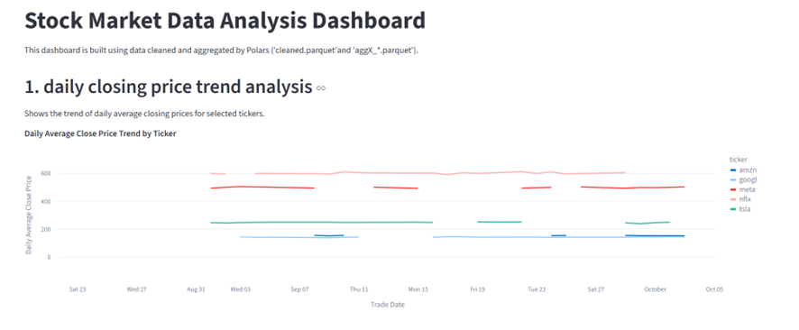
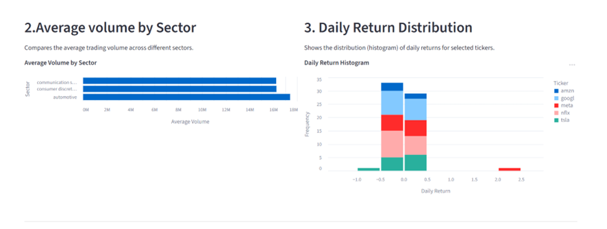
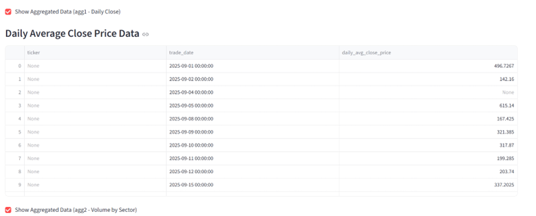
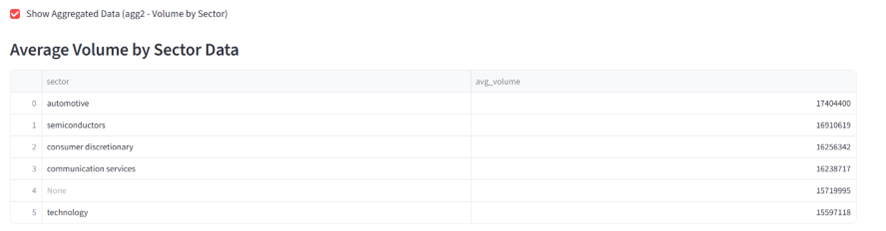
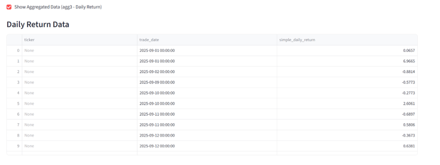

Stock Market Data Analysis Dashboard

This project uses Polars to process stock market data and Streamlit to create an interactive dashboard. The goal is to clean the raw data, generate several aggregated datasets, and visualize the results in a simple web app.

#Project Files

・data_prep.py
Reads the raw CSV file, cleans the data, and saves it as cleaned.parquet.

・aggregations.py
Takes the cleaned data and creates three aggregated files, such as daily average close price, sector-level average volume, and daily returns.

・app.py
A Streamlit app that loads the aggregated data and displays the charts with filters for sectors and tickers.

・cleaned.parquet
Output from the cleaning script.

・aggX_*.parquet
Aggregated datasets used by the dashboard.

#How to Run

Install the required libraries: pip install polars pandas streamlit altair

Run the scripts to generate the processed data:

python data_prep.py
python aggregations.py

Start the Streamlit app:

streamlit run app.py
Dashboard Features

The dashboard shows:

Daily average close price trends
Average volume by sector
Daily return distributions
All charts update based on the selected sector and ticker filters.

Screenshots:

